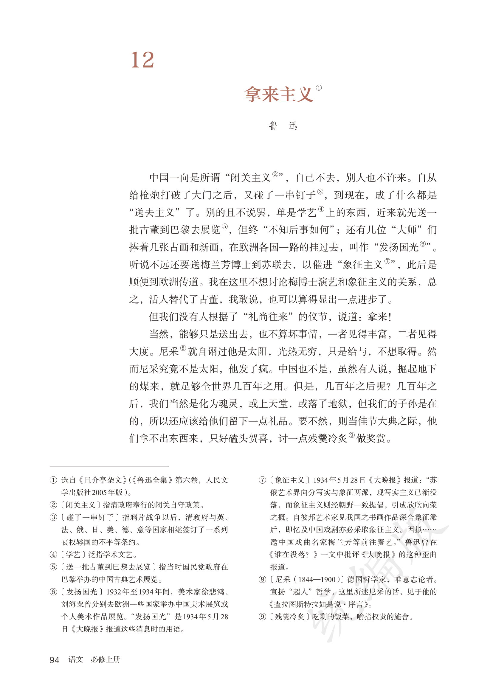
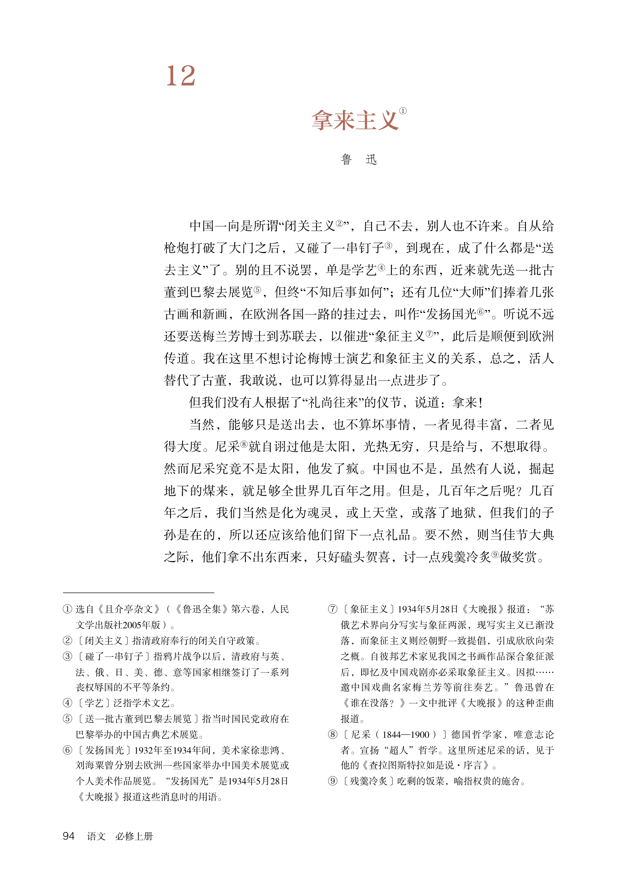
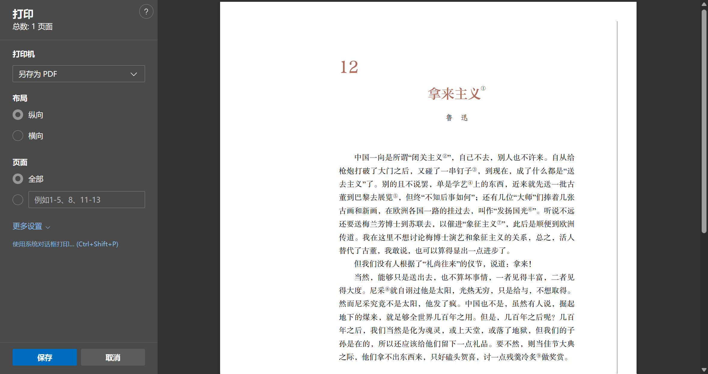
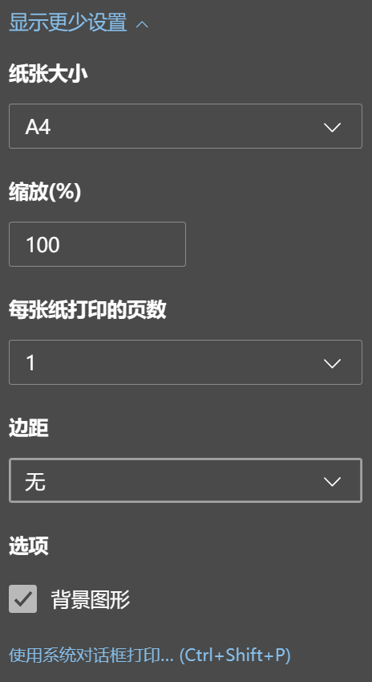

# High School Chinese Textbook

HTML + CSS + JavaScript 高仿部编版高中语文课本

## 效果预览

| 原版 | 高仿 |
| --- | --- |
|  |  |

由于 web 技术的限制，部分文字排版可能有所不同。（但绝对可以以假乱真！）

## 使用方法

### HTML 转 PDF

- Edge 浏览器

    打开 HTML 文件，找到 `打印` 选项（或直接按下 `Ctrl+P` 快捷键）；`打印机` 设为 `另存为 PDF`。

    

    打开 `更多设置`，`边距` 设为 `无`，并勾选 `背景颜色`（否则颜色会变得很奇怪，原因不明）。

    

    点击 `打印`，选择位置保存即可。

- 其它浏览器

    应当与 Edge 类似，或者[百度一下](https://www.baidu.com)“xx浏览器如何另存为PDF”

- 专用软件

    网上应该就有，或者[让我帮你百度一下](https://www.baidu.com/s?wd=html%E8%BD%ACpdf)

## 技术细节

- 标题颜色：`#ae6b5b`
- 字体：
    - 序号/标题：`方正准雅宋`
    - 作者：`方正仿宋`
    - 正文/注释：`Times New Roman` `方正书宋`
    - 注释序号：`Rope Sequence Numbers ST`
    - 注释拼音：`NEU-XT`
    - “学习提示”四字：`方正兰亭中黑`
    - 学习提示：`方正楷体`
    - 页脚：`方正书宋`
    - 页码：`Helvetica Light`